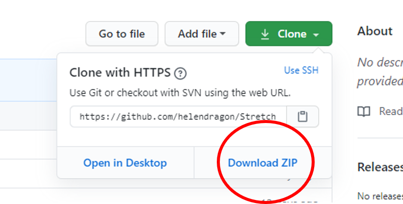
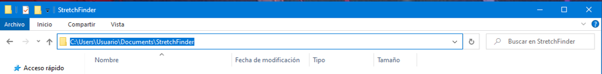

# StretchFinder Tutorial

StretchFinder is a tool that helps to analyze the codon composition in genomes. It has the basic pipelines needed in order to draw preliminary conclusions about the codon usage and composition of genomes. 

For any suggestion, bugs or problems, please contact: helena.96.14@gmail.com

## Prerequisites

* Download the program from GitHub   
To download StretchFinder from the GitHub repository click the green clone button, and select the **Download ZIP** button.   
This will download the program in a zip file. Decompress it and save it in your machine. 

    

         
    

    

* Python 3.X  
https://www.python.org/downloads/

* R 4.x  
https://cran.r-project.org/

* RStudio 1.3.X 
https://rstudio.com/products/rstudio/download/

* R packages  

    * Seqinr (Version 3.6-1)
    * Nnet (Version 7.3-13)   

        To install R packages, you can either do it using the terminal or with RStudio (recommended for Windows).   
    
    To install it through **terminal** just open a terminal and type and press enter:   
       
       R 
    This will open R in the terminal. Now once R is opened in the terminal, type:

        install.packages(c("Seqinr", "Nnet"))

    After doing this, the two R packages should be installed in your R environment. 

    To install the package using **RStudio**, just open the RStudio program, and go to the Packages tab in the right side of the interface:

    

         
    

    
    Then you need to click on the **Install** button, write the names of the packages that you want to install separated by a comma and click on install. 

    

         
    

    
    After doing this, the two packages should be installed in your R environment. 
    
* Python Dependencies
    
    StretchFinder needs some python dependencies to work properly. Which is done by running a simple command in the **terminal**.  First, open the terminal, the first step is going to the StretchFinder directory.

    * Windows

         Once the terminal is open, write:

            cd /path/to/my/file/StretchFinder 
        
        For example if my file is in the Documents file, the path would be : C:\Users\Usuario\Documents\Stretchfinder 

        You can obtain the path by copying what is shown int he file explorer like so:

            
        

             
        

        Once you have the path copied you can run the command like so:

            cd C:\Users\Usuario\Documents\Stretchfinder 
        
        In case the file is stored in another disk that it's not the default from the terminal (in this case would be the C: disk), you can change it by: (in the case we want to go to another disk called E:)

            E:
        By just typing this the disk will be changed to (in this case) E, and you will be able to go to a directory that's in that disk:

            cd E:\User\StretchFinder
    
    * Linux and Mac

    Once the terminal is open, write:

            cd /path/to/my/file/StretchFinder 
        
    For example if my file is in the Documents file, the path would be : Documentos/StretchFinder, so the command would be:

        cd Documentos/StretchFinder
    
    To directly open a terminal in the directory that you want, you can also go to that folder and open the terminal directly like shown in the pictures:

    

             
             
    

    Now that we have a terminal opened in the StretchFinder directory we must type: 
    (Warning Python must be installed!)

        pip install -r requirements.txt
    
    This should install all the packages needed for the program.

***    

## Getting started

This is how the user can open the program:

* Windows    
Double click on the **StretchFinder.exe** file found in the mail StretchFinder file. This should open the interface and a terminal window.    
If this method does not work please, follow the same steps as the other operation systems.

* Linux and Mac    
First open a terminal window, and change the working directory to the one where StretchFinder folder. (Explained in the Python Dependencies section)

Once the directory is the correct, run the command:

    python3 StretchFinder.py

This should open the StretchFinder interface. 

**Important Note**   
It is possible that windows users experiment some errors while trying to execute R scripts from the interface. A way to solve this is by going to the output file selected by the user, and running the script **run.R**, that will be generated automatically by the interface, directly in RStudio. 

If the User experiences any problems please contact: helena.96.14@gmail.com
***
## Input Files

### Retrieve CCDS Fasta Sequence Module

This Module oes from uniport ID (common output of proteomic analysis) to the gene name and consensus Coding Sequences (CCDSs).

The input must be a **list** or a **text document with a list** of uniprot protein IDs, and the directory where the files will be generated. 

The user can also input a fasta file with the CCDS of the organism, with the name of the gene with the format:

\> GeneName|CCDS|...

This tool only works for **Human** samples.   
In case the user needs to retrieve Fasta sequences from uniprot IDs from non-human samples, the module Retrieve Fasta Sequence Module. 

             

## Retrieve Fasta Sequence Module

This method is very similar to the one described above, however its purpose is obtaining the Fasta sequences from species that do not have CCDSs defined. This module goes from Uniprot ID to the Ensembl gene ID and uses the latter to retrieve the DNA sequence.

The input must be a **list** of uniprot protein IDs and the directory where the files will be generated. 

             

### Running Windows Module

The input must be a **fasta file** with the DNA sequence of the genes that the user wants to find stretches in.     
Then the user must define the **directory** where the output files will be generated and the **parameters** of the running windows module. 

The parameters that the running windows function uses are the window size, which corresponds to a fragment of the sequence with fixed size; A-codons (AA codons in StretchFinder), which are the codons corresponding to the amino acids that the user wants to study; the D-codons (Affected Codons in StretchFinder), which are the number of codons that the user is specifically studying (usually the ones modified by the tRNA modification); the threshold, which is the minimum of A codons present in a window; and the enrichment, the minimum D/A value that a stretch should have.

            
              

For each CDS of a transcriptome, a window slides codon by codon from the beginning to the end of the sequence. The number of A codons is calculated with respect to its location. We consider a stretch as those regions corresponding to a window or set of consecutive windows that have an A-codon count higher than the threshold and a D/A-codon ratio higher than the enrichment defined by the user.

### Get Consecutive Module

This method identifies consecutive sequences of a specific set of codons in a CDS. This module searches for regions in the CDS that have 5 or more consecutive sets of the selected codons, allowing at most 3 codons between these regions, which are defined as stretches.

The input for this method is a **Directory with ONLY the Fasta files**, the minimum number of consecutive codons to be considered a stretch (set to 5), the maximum number of codons between regions to be considered a stretch all together (set to 3), the codon sets to be analyzed, and the output directory where the results will be generated. 

             

### Get Codon Usage Module

This method counts the number of occurrences of the selected codons in each CDS. It goes codon by codon counting how many times the select-ed codons appear in the sequence. Then it divides the total occurrences of each of the selected codon by the total number of codons to provide the relative abundance of the codon sets.

The input for this method is a **Directory with ONLY the Fasta files**, the codon sets to be analyzed, and the output directory where the results will be saved. 

             

***
## Output Files

### Retrieve CCDS Fasta Sequence Module

The output are two **fasta files** with the CCDS sequences of the uniprot IDs given by the user. One of the files contains all the CCDS transcripts obtained for each uniprot ID, and the other only contains the longest transcript for each gene. 

## Retrieve Fasta Sequence Module
The output consists of a Fasta file containing the longest transcript of each gene, with the corresponding Uniprot ID and the Ensembl ID.

### Running Windows Module

The output files consist of:   
* CSV files with information of:   
    * All the stretches found in all the genes (strGenes_P2.csv)
    * The most enriched window for the genes with no stretches (allGenes_P1.csv)
    * The previous 2 files merged (allStr_2.csv)
    * The longest stretch for each gene (allStrUnique.csv)
* An html file with a visual representation of the 100 longest stretches of the results
* Rdata files to load the different steps of the algorithm:
    * genFasta.Rdata
    * genFastaClean.Rdata
    * rwAsum.Rdata
    * rwDsum.Rdata
    * rwMatrix.Rdata
    * rwSinfo.Rdata

### Get Consecutive Module

The output consists of 2 csv files, one containing all the stretch information from all the transcripts, and the other having only the information from the longest stretch from each transcript, as well as a simple graphical representation of the data.

### Get Codon Usage Module

The output is a csv with the ratio between the count of selected codons and the total length of the sequence, as well as a simple graphical representation of the data.

***
